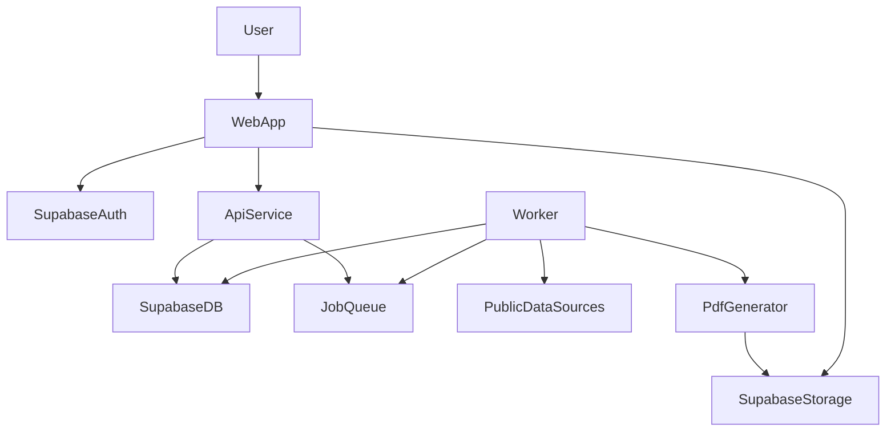

# PropertyPal Plan (Commercial Underwriting Portfolio Builder)

## Goals (what "done" looks like)

- User can input **1–50 addresses** (paste, CSV upload, or form rows).
- App normalizes/validates addresses, geocodes them, and enriches each with:
  - **Public tax/assessor** property characteristics
  - **Hazard/location** signals (flood/wildfire/wind/hail proxies, etc.)
  - **Photos/maps** (street/aerial/parcel context where permitted)
  - **Comps** (basic nearby similar properties/listings where permitted)
  - **Underwriter notes** + auto-generated **risk flags** and follow-up questions
- App renders a **polished portfolio** per property (consistent template) and a **portfolio summary** across the batch.
- User can download **one PDF** per address or **download all** (zip) from a batch.
- Data sourcing explicitly avoids **LoopNet scraping** (per your selection); LoopNet becomes:
  - a manual reference link field and/or
  - user-entered "listing details" fields (optional)

## Non-goals (for v1)

- No direct LoopNet extraction/scraping.
- No claims history integration unless you already have a licensed source.
- No ISO Protection Class unless you have a licensed source.

## Key assumptions (documented so we can build today)

- US-focused addressing (can expand later).
- Public-record coverage varies by county; the UI will show **data confidence + source coverage** and allow user overrides.
- PropertyPal provides **underwriting support**, not an authoritative record (clear citations and timestamps).

## Architecture (Vercel + Railway + Supabase)

### Frontend (Vercel)

- **Next.js (App Router)** web app with TypeScript
- **shadcn/ui** (Radix UI primitives + Tailwind) for reusable, accessible UI components
- **Tailwind CSS** for styling
- Supabase Auth UI and session handling
- Address import UI, batch progress UI, portfolio viewer, PDF download UI

**UI Components (shadcn/ui):**
- Address input table (1–50 rows), CSV upload, validation errors
- Batch progress list with status badges
- Portfolio viewer layout (tabs/accordion/cards)
- Override edit forms (inputs/selects/date pickers)
- Export/download dialogs and toast notifications

**Note:** shadcn components will be generated into `apps/web/components/ui/*` (default shadcn pattern). Radix primitives will be used via shadcn/ui; no separate component library will be added unless required.

### Backend (Railway)

- **API service** (Node/TypeScript)
  - validates batches, starts enrichment jobs, serves portfolio data
- **Worker service**
  - executes enrichment pipeline, rate-limits calls, retries, writes results
- **Job queue**
  - simplest: Postgres-backed queue in Supabase (table-driven) + worker polling
  - or add Redis queue on Railway later if needed for scale

### Data/Auth/Storage (Supabase)

- **Postgres** for normalized entities and snapshots
- **Row Level Security (RLS)** for multi-user isolation
- **Supabase Storage** for generated PDFs and attachments

### High-level flow

## Data sourcing strategy (free-first, with optional paid upgrades)

### Free / permitted sources (recommended v1)

- **Geocoding**
  - Primary: OpenStreetMap Nominatim (free, rate-limited; cache aggressively)
  - Alternative: US Census Geocoder (free, US addresses)
- **Parcel/assessor/tax**
  - County assessor APIs / open data portals (varies)
  - Where no API: provide "manual entry" and/or a semi-automated "upload assessor card PDF" flow (v1.1)
- **Flood**
  - FEMA NFHL / Flood Map Service Center datasets (public)
- **Wildfire**
  - USFS Wildfire Hazard Potential (public, coarse)
  - State open data where available (optional)
- **Wind/hail** (proxy)
  - NOAA storm events datasets (public; more historical than predictive)
- **Imagery / maps**
  - Map tiles: MapLibre + OSM tiles (be mindful of terms; consider a hosted tile provider if needed)
  - Street-level imagery: link out to Google/Apple/Bing maps (avoid embedding if licensing is unclear)
- **Comps (free-first)**
  - Use permitted APIs for places/nearby POIs (OpenStreetMap Overpass with rate-limits) + simple "nearby similar parcels" heuristic from assessor data when available.

### Paid options (only if you choose to optimize for coverage/accuracy)

- **Property characteristics & comps**: CoreLogic / ATTOM / Regrid / LightBox (varies by region/licensing)
- **Replacement cost**: Marshall & Swift / Verisk (commercial licensing)
- **Hazard scoring**: First Street (flood/wildfire), Risk Factor integrations (licensing)
- **Geocoding & maps**: Google Maps Platform or Mapbox (usage-based)

### Source-of-truth and citations

- Every field stored with:
  - **source_name**, **source_url (if any)**, **retrieved_at**, **confidence**, **raw_payload snapshot**
- Portfolio PDF includes a **Sources & Timestamp** section.

## Product UX (screens)

### 1) Sign in / Workspace

- Supabase Auth (email magic link or password)
- Workspace concept (single org per user in v1; expand later)

### 2) New Batch ("Portfolio Run")

- Input addresses:
  - paste newline-separated
  - add rows
  - upload CSV
- Pre-check:
  - dedupe
  - validate (ZIP/city/state)
  - show "needs clarification" (multiple geocode matches)
- Start run

### 3) Batch Progress

- Per-address status: queued → enriching → ready / needs review / failed
- Show partial results as they arrive
- "Retry failed" and "Edit address" actions

### 4) Property Portfolio Viewer

- Executive summary + key underwriting fields
- Tabs: Property, Occupancy, Valuation/Tax, Hazards, Photos/Map, Comps, Notes
- Editable fields with "user override" tracked separately
- Risk flags and follow-up questions (e.g., roof age unknown → request; flood zone AE → verify elevation certificate)

### 5) Export

- Download single PDF
- Download all PDFs as zip
- Optional "Combined PDF" later (append per property)

## Data model (Supabase Postgres)

### Core tables

- **organizations**(id, name, created_at)
- **users**(id, org_id, email, role)
- **batches**(id, org_id, name, created_at, status, input_count)
- **properties**(id, org_id, canonical_address, lat, lon, geocode_confidence, created_at)
- **batch_properties**(batch_id, property_id, status, error_code, error_detail)
- **property_snapshots**(id, property_id, batch_id, created_at)
  - immutable snapshot per run for auditability
- **property_fields**(snapshot_id, field_key, field_value_json, source_name, source_ref, retrieved_at, confidence)
- **property_overrides**(property_id, field_key, field_value_json, updated_by, updated_at)
- **documents**(id, org_id, batch_id, property_id, type, storage_path, created_at)
  - type: portfolio_pdf, batch_zip, attachment
- **jobs**(id, batch_id, property_id, kind, status, attempts, run_after, last_error, created_at, updated_at)

### RLS rules (high level)

- All selects/updates restricted by `org_id` via authenticated user JWT claims.

## Enrichment pipeline (worker)

For each property in a batch:

1. **Normalize address** (libpostal or similar) and validate required components.
2. **Geocode** (Census first for US; fallback Nominatim). Cache results.
3. **Parcel/assessor lookup**

   - Determine county/parcel jurisdiction from geocode
   - Attempt available county open data connectors
   - If unavailable: mark "coverage gap", keep pipeline moving

4. **Hazards**

   - Flood zone lookup (FEMA)
   - Wildfire hazard potential lookup
   - Basic wind/hail context (optional v1; depends on dataset access)

5. **Maps/photos**

   - Store map links (street view, aerial) as URLs (avoid licensing issues)

6. **Comps**

   - "Nearby similar parcels" (if assessor data has use code + size)
   - Basic radius-based nearby listing links (user can add) as a manual step

7. **Synthesis**

   - Generate risk flags + follow-up questions
   - Summarize in an "executive narrative" (optional: LLM; can be disabled)

8. **Persist snapshot** to `property_snapshots` + `property_fields`.

## PDF generation

- Render an HTML template (server-side) and generate PDF via **Playwright/Chromium** in Railway worker.
- Store PDFs in **Supabase Storage**.
- Batch export:
  - generate zip server-side (worker)
  - store zip in Storage and provide a signed download URL.

## API surface (Railway API)

- `POST /batches` create batch + addresses
- `GET /batches/:id` batch metadata + statuses
- `GET /properties/:id?batchId=` portfolio data (merged snapshot + overrides)
- `POST /properties/:id/overrides` save underwriter edits
- `POST /batches/:id/export` enqueue PDF generation (single/all)
- `GET /documents/:id/download` returns signed Storage URL

## Tech stack choices (concrete)

- **Frontend**: Next.js + TypeScript, **shadcn/ui** (Radix UI + Tailwind), Tailwind CSS, MapLibre
- **Backend**: Node.js + TypeScript (Fastify or NestJS)
- **DB/Auth/Storage**: Supabase
- **Queue**: Supabase Postgres jobs table (v1)
- **PDF**: Playwright
- **Observability**: structured logs + basic job metrics

## Legal/compliance considerations (must-do)

- No scraping LoopNet; only use sources with explicit permission or public records.
- Provide citations and timestamps; add disclaimer that output is informational.
- Add user audit trail for overrides.

## Milestones (build order)

### Milestone A — Skeleton app (same day)

- Create Next.js app on Vercel
- Supabase project: Auth + tables + RLS
- Railway API/worker services with health endpoints
- Initialize shadcn/ui in Next.js app

### Milestone B — Batch + geocode (1–2 days)

- Address input UI + CSV import (using shadcn/ui components)
- Batch creation endpoint
- Worker: normalize + Census/Nominatim geocode with caching
- Batch progress UI (using shadcn/ui badges and tables)

### Milestone C — Public-record connectors (2–7 days, iterative)

- Implement 1–2 "pilot counties" connectors (where you underwrite most)
- Store parcel/assessor results with source metadata
- Add coverage-gap UX + manual field entry (using shadcn/ui forms)

### Milestone D — Hazards + maps (1–3 days)

- Flood zone integration
- Wildfire hazard potential integration
- Map links + map preview

### Milestone E — Portfolio viewer + overrides (2–4 days)

- Portfolio template components (using shadcn/ui tabs, cards, accordions)
- Risk flags + follow-up questions
- Overrides UI + persistence (using shadcn/ui form components)

### Milestone F — PDFs + batch export (2–4 days)

- HTML → PDF rendering
- Single and batch export (zip)
- Storage + signed download links (using shadcn/ui dialogs and toasts)

## MVP definition (what you can ship first)

- Batch input (1–50)
- Geocode + basic parcel/assessor (at least one high-volume county)
- Flood + wildfire basic
- Portfolio viewer with citations + notes
- PDF export per property + download all

## Implementation todos (concrete)

- **proj-bootstrap**: Create Next.js app + Railway services + Supabase project, wire auth, initialize shadcn/ui.
- **db-schema-rls**: Create tables, RLS policies, and org/user bootstrap flow.
- **batch-ingest**: Build address import/validation + `POST /batches` (using shadcn/ui table and form components).
- **geocode-worker**: Implement normalization + geocoding + caching + job orchestration.
- **assessor-connectors**: Build connectors for your top 1–2 counties and a fallback manual workflow.
- **hazards**: Add FEMA flood + wildfire hazard layers and store results per snapshot.
- **portfolio-ui**: Build portfolio pages, risk flags, and override editing (using shadcn/ui components).
- **pdf-export**: Implement Playwright PDF template and batch zip export.
- **ops-guardrails**: Add rate limiting, retries, audit logs, and source citations.

## What I still need from you (next step after this plan is accepted)

- Target geography: the **top 1–3 states/counties** you underwrite most (so we implement the right assessor connectors first).
- Branding preferences for the PDF (simple/modern vs insurer-style formal) and what fields are "must-have on page 1."
