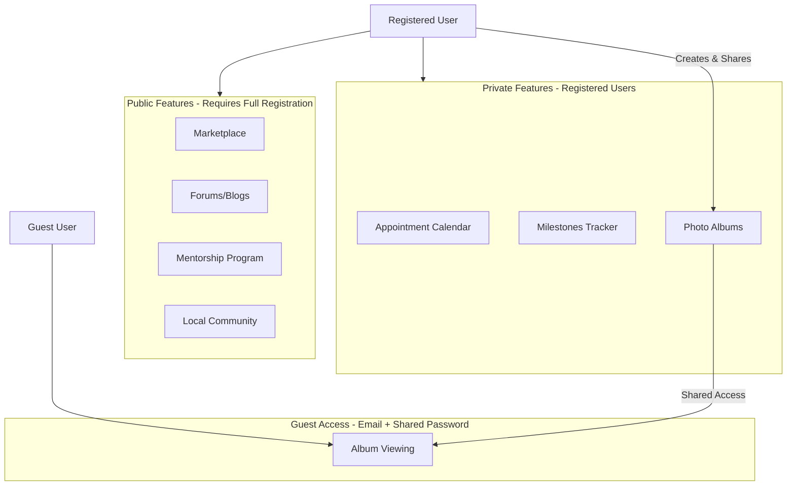
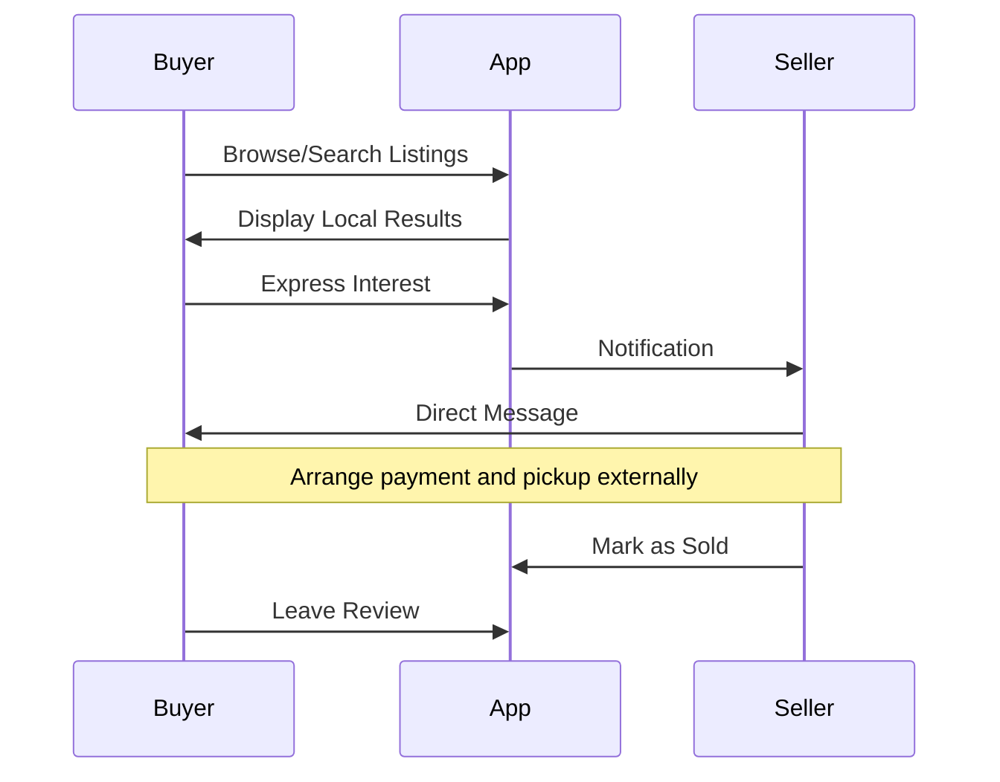
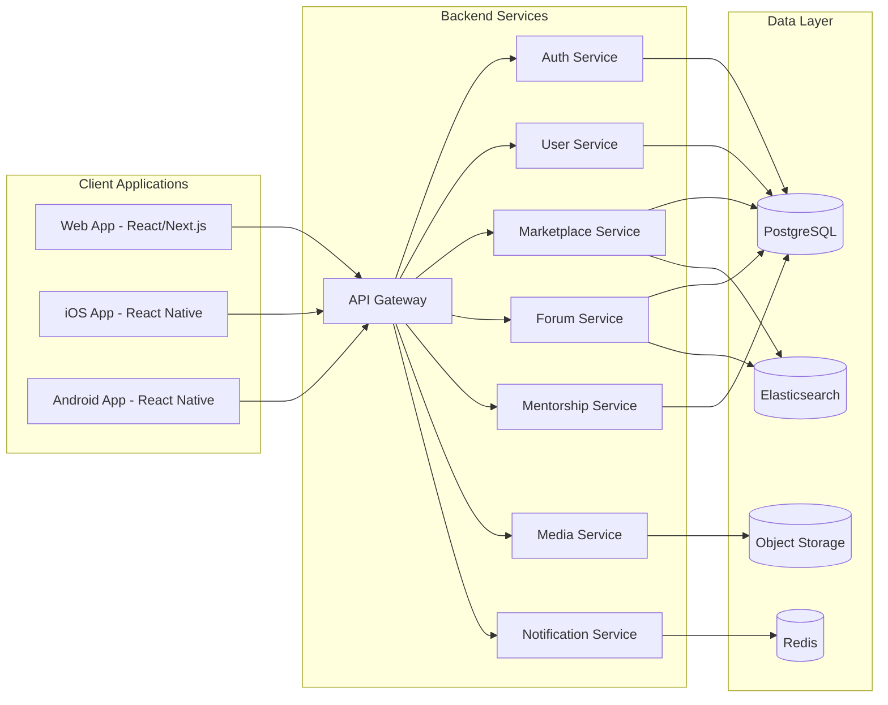
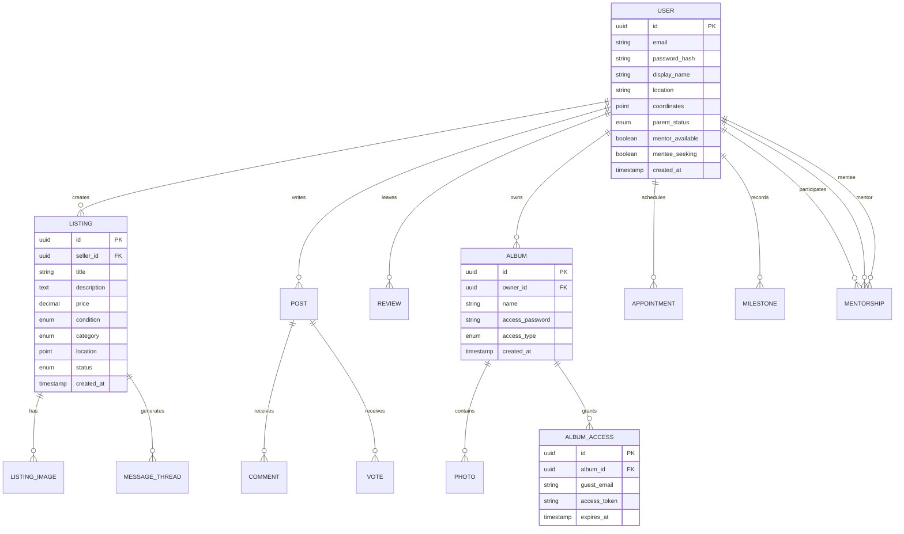

# New Parent App - Comprehensive Planning Document

## Executive Summary

A cross-platform application designed to support new and expecting parents through community-driven features and private family tools. The app targets primarily new mothers while remaining inclusive to all parents, offering both public engagement features and private family management tools.

---

## Target Audience

| Segment | Description |
|---------|-------------|
| Primary | New and expecting mothers seeking community support and information |
| Secondary | Fathers and partners supporting the parenting journey |
| Tertiary | Experienced parents willing to mentor newcomers |
| Extended | Family members accessing shared albums (guest access) |

---

## Feature Architecture Overview

---

## Public Features Specification

### 1. User Profiles and Authentication

**Registration Fields:**

- Email (required)
- Password (required)
- Display name
- Profile photo
- Location (city/zip for local content)
- Parent status: Expecting / New Parent / Experienced Parent
- Child information (optional): Due date or birth date(s)
- Mentor/Mentee opt-in toggle
- Interests/topics of focus

**Privacy Controls:**

- Public profile visibility toggle
- Location precision control (exact vs. general area)
- Searchability in mentor directory

### 2. Marketplace

**Listing Features:**

- Product categories: Clothing, Gear, Furniture, Toys, Feeding, Safety, etc.
- Photo uploads (multiple per listing)
- Condition rating: New / Like New / Good / Fair
- Price and negotiability flag
- Location-based visibility (configurable radius)
- Seller ratings and reviews

**Buyer Features:**

- Search with filters (category, price range, condition, distance)
- Save/favorite listings
- Direct messaging with sellers
- Report inappropriate listings

**Transaction Flow:**

### 3. Forums and Blog Content

**Structure:**

- Categories: Doctor Reviews, Childcare Reviews, Product Reviews, General Discussion, Local Events
- Location-tagged content for local relevance
- Upvote/downvote system for quality curation
- Threaded replies
- Rich text with image support
- Tagging system for topics

**Moderation:**

- Community flagging
- Admin review queue
- Automated content filtering
- Verified reviewer badges

### 4. Mentorship Program

**Opt-In Process:**

- Toggle in profile settings
- Role selection: Mentor / Mentee / Both
- Experience questionnaire for mentors
- Needs assessment for mentees
- Availability preferences

**Matching System:**

- Location proximity (optional preference)
- Experience alignment (pregnancy stage, child age)
- Topic interests
- Manual selection from directory with filters
- Optional algorithm-suggested matches

**Communication:**

- In-app messaging
- Optional video call scheduling integration
- Progress tracking for mentorship relationships
- Feedback and rating system

---

## Private Features Specification

### 5. Appointment Calendar

**Features:**

- Add/edit/delete appointments
- Categories: Doctor visits, ultrasounds, vaccinations, checkups, classes
- Reminder notifications (push and email)
- Recurring appointment support
- Notes and preparation checklists
- Partner sharing (invite by email)
- Sync with device calendar (optional)

### 6. Milestones Tracker

**Predefined Milestones:**

- Pregnancy milestones (by week/trimester)
- Baby development milestones (first smile, first steps, first words, etc.)
- Custom milestone creation

**Features:**

- Date recording
- Photo/video attachment
- Notes and journal entries
- Timeline view
- Shareable milestone cards (social sharing)

### 7. Photo Albums

**Account Owner Features:**

- Create multiple albums
- Upload photos and videos
- Add captions and dates
- Organize by event, date, or custom categories
- Set album access method (see below)

**Access Options (Flexible Implementation):**

| Method | Description | Security Level |
|--------|-------------|----------------|
| Shared Password | Single password owner shares with family | Basic |
| Invite Links | Unique link per album, no password | Moderate |
| Guest Accounts | Email + shared password per album | Moderate |
| Time-Limited Links | Auto-expiring access links | Higher |

**Guest User Experience:**

- Email entry for identification/tracking
- Password entry (if using shared password method)
- View-only access to shared albums
- Download individual photos (if permitted by owner)
- Comment on photos (optional feature)

---

## Technical Architecture

### Platform Strategy

### Recommended Tech Stack

| Layer | Technology | Rationale |
|-------|------------|-----------|
| Web Frontend | Next.js (React) | SSR for SEO, great DX |
| Mobile | React Native | Code sharing, cross-platform |
| API | Node.js with Express or NestJS | JavaScript ecosystem consistency |
| Database | PostgreSQL | Relational data, PostGIS for location |
| Cache | Redis | Sessions, real-time features |
| Search | Elasticsearch | Full-text search for marketplace/forums |
| Storage | AWS S3 or Cloudflare R2 | Media files, cost-effective |
| Auth | Auth0 or Supabase Auth | Secure, feature-rich |
| Push Notifications | Firebase Cloud Messaging | Cross-platform support |

### Database Schema (Core Entities)

---

## MVP Scope (Balanced Approach)

### Phase 1 - Core MVP (Months 1-3)

**Public Features:**

- User registration and profiles
- Basic marketplace (listings, search, messaging)
- Simple forum with categories
- Mentorship program (opt-in, directory, matching, messaging)

**Private Features:**

- Appointment calendar
- Basic photo albums with shared password access

### Phase 2 - Community Expansion (Months 4-6)

**Public Features:**

- Enhanced location-based features
- Review and rating system
- Forum enhancements (voting, threading)

**Private Features:**

- Milestones tracker
- Additional album access methods
- Calendar sharing with partners

### Phase 3 - Polish and Scale (Months 7-9)

- Push notifications
- Email digests
- Advanced search and recommendations
- Mobile app optimization
- Performance and security hardening

---

## Security Considerations

| Area | Approach |
|------|----------|
| Authentication | JWT tokens, refresh token rotation, MFA option |
| Album Guest Access | Rate limiting, access logging, optional expiration |
| User Data | Encryption at rest, HTTPS only, GDPR compliance |
| Location Data | Fuzzy location display options, precise data server-side only |
| Content Moderation | Automated scanning, user reporting, admin tools |
| Messaging | End-to-end encryption consideration for sensitive discussions |

---

## Monetization Opportunities (Future)

- Featured marketplace listings
- Premium mentor profiles
- Extended album storage
- Ad-free experience
- Local business partnerships (doctor/childcare advertising)

---

## Success Metrics

| Metric | Target (Year 1) |
|--------|-----------------|
| Registered Users | 10,000+ |
| Monthly Active Users | 40% of registered |
| Marketplace Listings | 5,000+ |
| Forum Posts | 500+ monthly |
| Active Mentorships | 200+ |
| Album Guest Access Sessions | 20,000+ monthly |

---

## Next Steps

1. Validate feature priorities with target user interviews
2. Create detailed wireframes for core user flows
3. Set up development environment and CI/CD pipeline
4. Begin Phase 1 MVP development
5. Establish content moderation policies and guidelines

